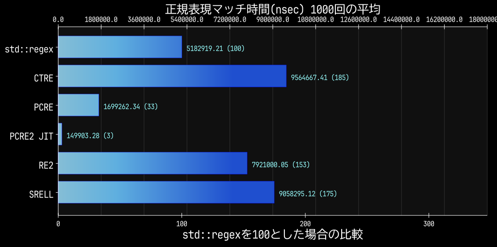
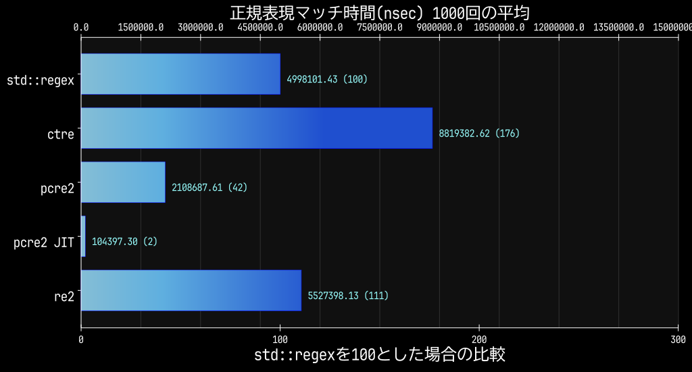
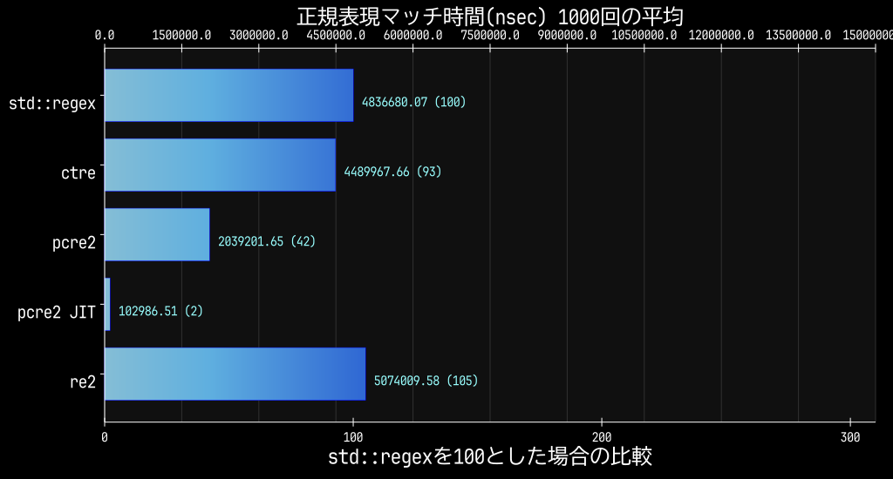
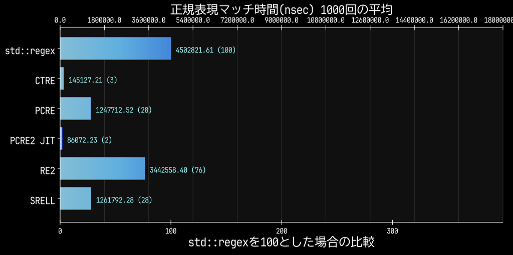
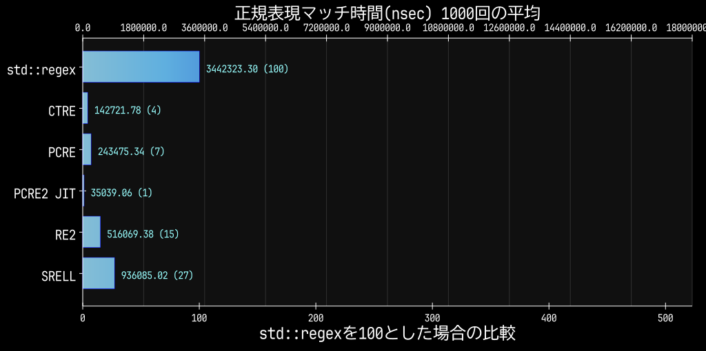

# 正規表現ライブラリの実行時間比較

## 概要

正規表現ライブラリの実行時間を比較するためのコードと結果をまとめています。

背景を含めた話を纏めたブログ記事は[こちら](https://toge-blog.com/posts/2026-05-01-regex-bench/)に書いています。

## 想定している利用用途

- 大量のHTMLデータから特定の情報を抽出するようなケースを想定しています。
- 単発のツールを想定しているため正規表現のコンパイル時間も含めて計測しています。

## 検索データ

BOOTHの技術書カテゴリの新着順で検索した結果を使用しています。
以下のコマンドで検索結果を取得して、data/sample.html として保存してください。
このファイル名をハードコードしているので、配置されていないと計測できません。

```
curl 'https://booth.pm/ja/browse/%E6%8A%80%E8%A1%93%E6%9B%B8?sort=new'
```

## 実行結果

### パターン1

```regex
<li class="item-card[\s\S]*?data-product-id="([0-9]+)"[\s\S]*?data-product-price="([0-9]+)"[\s\S]*?<div class="item-card__title"><a[\s\S]*?href="(https://booth\.pm/ja/items/[0-9]+)">([\s\S]*?)</a>[\s\S]*?<div class="item-card__shop-name">
```

CTREが圧倒的に遅いですが、RE2も地味に遅いです。

| 正規表現ライブラリ |  gcc 15.2.1 |  gcc 16.1.1 |
| ------------------ | ----------: | ----------: |
| std::regex         | 5182919.215 | 7543290.314 |
| CTRE               | 9564667.406 |  141629.136 |
| PCRE               | 1699262.345 | 1828889.212 |
| PCRE JIT           |  149903.278 |  145392.913 |
| RE2                | 7921000.055 | 7929126.965 |
| SRELL              | 9058295.117 | 9277444.704 |
| Boost::regex       |             |  259644.428 |
※ 数値は実行時間 (ns) です。



### パターン2

```regex
<li class="item-card[\s\S]*?data-product-id="([0-9]+)"[\s\S]*?data-product-price="([0-9]+)"[\s\S]*?<div class="item-card__title"><a[\s\S]*?href="(https://booth\.pm/ja/items/[0-9]+)">([\s\S]*?)</a>
```

| 正規表現ライブラリ |   gcc 15.2.1 |   gcc 16.1.1 |
| ------------------ | -----------: | -----------: |
| std::regex         |  4880321.712 |  7086328.988 |
| CTRE               |  8741924.539 |   139203.581 |
| PCRE               |  1368955.296 |  1480158.560 |
| PCRE JIT           |   100127.688 |   102035.587 |
| RE2                |  5336477.190 |  5426826.941 |
| SRELL              | 16365645.722 | 17504940.225 |
| Boost::regex       |              |   255244.243 |
※ 数値は実行時間 (ns) です。



### パターン3

```regex
<li class="item-card[\s\S]*?data-product-id="([0-9]+)"[\s\S]*?data-product-price="([0-9]+)"[\s\S]*?<div class="item-card__title"><a[\s\S]*?href="(https://booth\.pm/ja/items/[0-9]+)">
```

急にCTREの実行時間が増加します。
RE2もstd::regexに負けはじめます。

| 正規表現ライブラリ |  gcc 15.2.1 |  gcc 16.1.1 |
| ------------------ | ----------: | ----------: |
| std::regex         | 4462579.565 | 7053312.321 |
| CTRE               | 4497637.271 |  138561.661 |
| PCRE               | 1310420.513 | 1433141.207 |
| PCRE JIT           |   99205.765 |   97876.234 |
| RE2                | 5115400.612 | 5047880.196 |
| SRELL              | 2744196.784 | 2856391.224 |
| Boost::regex       |             |  254015.930 |
※ 数値は実行時間 (ns) です。



### パターン4

```regex
<li class="item-card[\s\S]*?data-product-id="([0-9]+)"[\s\S]*?data-product-price="([0-9]+)"[\s\S]*?<div class="item-card__title"><a
```

| 正規表現ライブラリ |  gcc 15.2.1 |  gcc 16.1.1 |
| ------------------ | ----------: | ----------: |
| std::regex         | 4502821.614 | 6747916.231 |
| CTRE               |  145127.210 |  139002.033 |
| PCRE               | 1247712.525 | 1331378.646 |
| PCRE JIT           |   86072.230 |   86095.627 |
| RE2                | 3442558.399 | 3438428.242 |
| SRELL              | 1261792.276 | 1275549.020 |
| Boost::regex       |             |  246107.491 |
※ 数値は実行時間 (ns) です。



### パターン5

```regex
<li class="item-card([\s\S]*?)data-product-id="([0-9]+)"[\s\S]*?data-product-price=
```

※プレースフォルダの数を合わせるために若干パターンを変更しています。

| 正規表現ライブラリ |  gcc 15.2.1 |  gcc 16.1.1 |
| ------------------ | ----------: | ----------: |
| std::regex         | 3442323.303 | 5554314.198 |
| CTRE               |  142721.777 |  141877.626 |
| PCRE               |  243475.344 |  249044.716 |
| PCRE JIT           |   35039.063 |   32549.569 |
| RE2                |  516069.377 |  497202.095 |
| SRELL              |  936085.019 |  943836.245 |
| Boost::regex       |             |  219900.021 |
※ 数値は実行時間 (ns) です。



## 計測環境

| 項目       | 環境1           | 環境2           |
| ---------- | --------------- | --------------- |
| CPU        | Ryzen 7 7700    | Ryzen 7 7700    |
| OS         | Fedora Linux 43 | Fedora Linux 44 |
| コンパイラ | g++ 15.2.1      | g++ 16.1.1      |

正規表現ライブラリのバージョン

| ライブラリ | バージョン        |
| ---------- | ----------------- |
| std::regex | C++標準ライブラリ |
| Boost      | 1.90.0            |
| CTRE       | 3.10.0            |
| PCRE2      | 10.47             |
| RE2        | 2025-11-05        |
| SRELL      | 2026-01           |

## まとめ

1. PCRE2のJITコンパイルは非常に高速で、他のライブラリと比べて圧倒的なパフォーマンスを発揮しています。
2. std::regexは大抵のパターンで最も遅いですが、CTREのように極端に遅くなるパターンはほぼありません。
3. CTREほど極端ではありませんが、RE2もbacktrackingが発生するパターンでは性能低下が見られます。
4. 単純なパターンではCTREはPCRE2のJITに匹敵する性能を発揮します。
